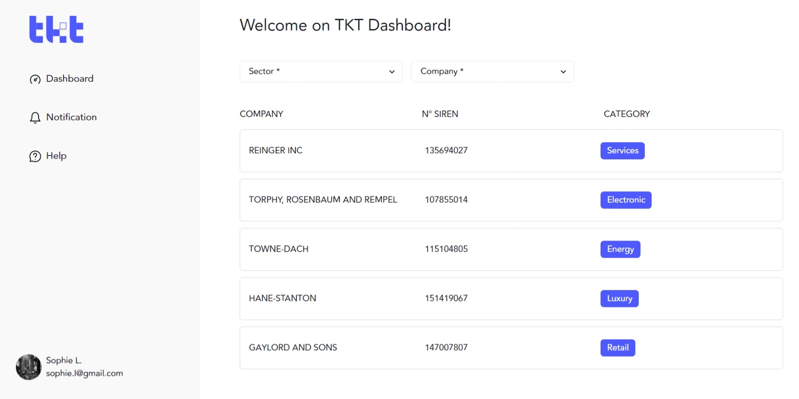

# TKT Dashboard



This is a dashboard for the TKT project. It is a simple web application that requests data from the TKT API and displays it in a nice way.

## Setup

### Install dependencies

```bash
npm install
```

### Run the app

```bash
npm start
```
